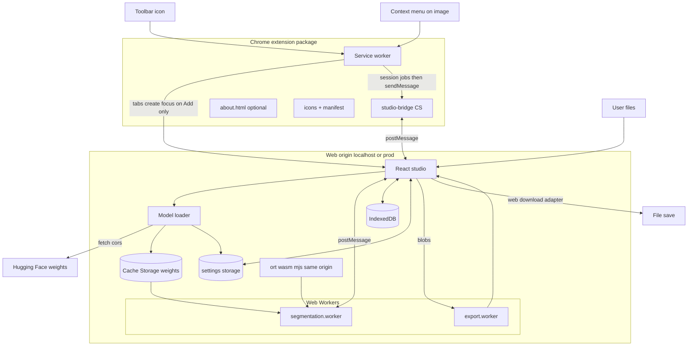
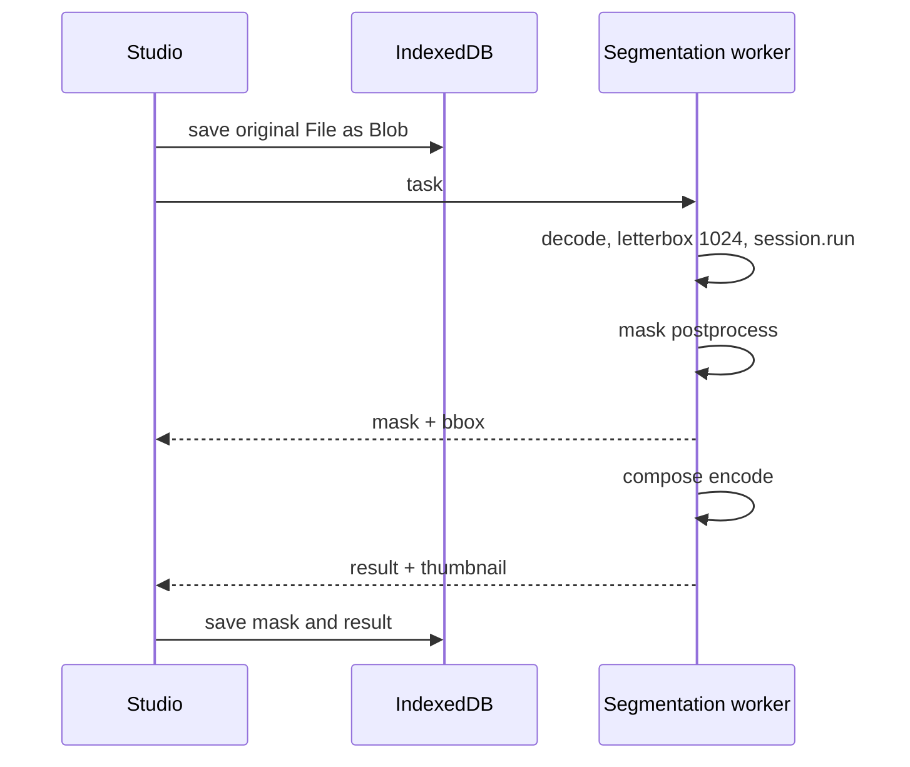

# 02. Архитектура

## Два артефакта, один репозиторий

| Артефакт | Сборка | Содержимое |
| --- | --- | --- |
| **Web-студия** | `vite.config.web.ts` → `dist-web/` | React UI, workers, ORT wasm/mjs, about |
| **Расширение** | `vite.config.ts` → `dist/` | service worker, studio-bridge CS, about, icons, manifest |

Студия **не** открывается как `chrome-extension://…/studio.html`. Service worker
открывает URL web-студии — по умолчанию `http://localhost:5173/studio` (`VITE_STUDIO_WEB_URL` →
`STUDIO_WEB_URL` в `src/platform/studio-url.ts`). **Add to PNG Maker** фокусирует вкладку;
**Save without background** открывает/использует вкладку без фокуса. Прод: тот же env на
сборке расширения подставляет URL и совпадающие `host_permissions` /
`content_scripts.matches` (см. раздел permissions и [07-build.md](07-build.md)).

Shared-код (`src/core`, `src/studio`, `src/workers`, `src/platform`, `src/shared`) общий;
границы npm-пакетов и monorepo пока не вводим.

## Контексты исполнения

- **Service worker** (`background`). Иконка → вкладка студии (с фокусом). Контекстное
  меню на `image`: extract картинки → job в `chrome.storage.session` → доставка CS;
  фокус студии только для Add. Обработки изображений (ONNX) нет.
- **Content script** (`studio-bridge.js`) — **только** на origin студии: мост
  `chrome.runtime` ↔ `window.postMessage` (jobs + синк имён экспортов для меню).
- **Страница студии** (`/studio` на origin web-приложения). React: сессия, UI, очередь, IndexedDB,
  platform-адаптеры storage/download/assets, fetch весов, приём jobs из bridge;
  скачивание файлов (включая silent Save) — здесь. Production: installable PWA
  (`manifest.webmanifest` + shell `sw.js`, scope `/studio`); не заменяет Chrome-расширение (ПКМ / иконка).
- **Лендинг** (`/`) — маркетинговая оболочка на том же origin (каркас; контент позже).
- **Воркер сегментации** (`segmentation.worker.ts`). `InferenceSession`, decode, model run, mask / compose.
- **Воркер экспорта** (`export.worker.ts`). ZIP через fflate.
- **About** — `/about/` в web-сборке; в extension-сборке остаётся
  страницей `about.html` расширения (офлайн-политиками), ссылка «назад» ведёт на URL студии.

Композиция в v1 живёт в воркере сегментации (`OffscreenCanvas`).

## Слой платформы (`src/platform/`)

Chrome-специфика не размазана по UI/core. Флаг сборки `import.meta.env.VITE_APP_TARGET`
(`web` | `extension`):

| API | extension target | web (фактическая студия) |
| --- | --- | --- |
| настройки | `chrome.storage.local` | `localStorage` (префикс `rmbg:`) |
| скачивание файлов | `chrome.downloads` (ветка в коде; в thin package не используется) | File System Access / `<a download>` |
| URL статики | `chrome.runtime.getURL` | `new URL(..., origin)` (абсолютный; нужен ORT) |
| URL студии | `VITE_STUDIO_WEB_URL` → `STUDIO_WEB_URL` | — |

## Диаграмма контекстов



## Поток данных для одного изображения



## Разделение «сегментация» и «композиция»

Дорогая сегментация один раз; маска в IndexedDB; смена export / edge / override — только
`compose`. Модули: `segment(image) -> Mask`, `compose(image, mask, settings) -> Blob`.

## Манифест расширения и permissions

Модель доступов **зафиксирована** для thin package + hosted studio. Конкретный origin
студии задаётся **на билде** через `VITE_STUDIO_WEB_URL` (default localhost) — один
источник для `STUDIO_WEB_URL`, `host_permissions` и `content_scripts.matches`
(плагин `rmbg:inject-studio-origin` в `vite.config.ts`). `public/manifest.json` в репо
держит localhost как шаблон структуры; в `dist/manifest.json` после сборки — фактический
origin.

Примеры:

- локально: `npm run build` / `npm run dev` → `http://localhost:5173/studio`
- стор: скопировать `.env.store.example` → `.env.store`, подставить домен `/studio`,
  `npm run package:store` (mode `store`)
- разово: `VITE_STUDIO_WEB_URL=https://app.example.com/studio npm run package`

```json
{
  "manifest_version": 3,
  "name": "PNG Maker",
  "version": "0.1.0",
  "minimum_chrome_version": "121",
  "action": { "default_title": "Open PNG Maker" },
  "background": { "service_worker": "service-worker.js", "type": "module" },
  "permissions": ["storage", "contextMenus", "activeTab", "scripting"],
  "host_permissions": ["http://localhost:5173/*"],
  "optional_host_permissions": ["http://*/*", "https://*/*"],
  "content_scripts": [
    {
      "matches": ["http://localhost:5173/*"],
      "js": ["studio-bridge.js"],
      "run_at": "document_end"
    }
  ],
  "content_security_policy": {
    "extension_pages": "script-src 'self'; object-src 'self'"
  }
}
```

| Поле | Зачем | Install-time |
| --- | --- | --- |
| `storage` | `menuExports`, `studioOrigin`, session `extJobs` | да |
| `contextMenus` | ПКМ Add / Save without background | да |
| `activeTab` + `scripting` | one-shot `blob:` во вкладке клика (`executeScript`) | да (временный доступ к вкладке жеста) |
| `host_permissions` | **только** origin студии: `tabs.query({ url })`, фокус вкладки, матч CS | да — один first-party origin |
| `optional_host_permissions` (`http://*/*`, `https://*/*`) | пул для `permissions.request({ origins: [imageOrigin + '/*'] })` при ПКМ → `fetch` в SW | **нет** широкого гранта; Chrome спрашивает конкретный origin |
| `content_scripts` | `studio-bridge.js` только на origin студии | инжект только на matches |

Чего **нет** и не нужно:

- `tabs`, `downloads` — save делает web-студия; URL-фильтр вкладок покрыт studio `host_permissions`;
- обязательного `*://*/*` — весь открытый веб не запрашиваем при установке;
- `wasm-unsafe-eval` / HF в extension CSP — ORT и веса на web origin;
- COEP/COOP в манифесте — isolation только на хосте студии (Vite / CDN).

Extract при ПКМ (`extract-image.ts`):

- `data:` — decode в SW;
- `blob:` — inject во вкладке клика (`activeTab` + `scripting`);
- `http(s):` — `beginImageHostAccess` **синхронно из обработчика клика** (до любого
  `await`, иначе Chrome глотает gesture), затем SW `fetch`.

Настройки студии — `localStorage` сайта. В `chrome.storage.local` расширения — origin
студии (маркер CS) и `{id,name}` экспортов для submenu.

## Сеть

**Web-студия** (не extension): разовая загрузка `.onnx` с HF обычным CORS
(`mode: 'cors'`), SHA-256, Cache Storage. ORT `.wasm`/`.mjs` — same-origin
(`/ort/` или absolute `origin/ort/`). Extension `host_permissions` для HF **не** нужны:
fetch идёт со страницы студии. Если у HF пропадёт ACAO — это проблема web CORS /
запасной прокси или зеркала на своём origin, а не повод вешать HF в манифест расширения.

**Расширение** при ПКМ: только гибридный extract выше (не «fetch любого URL без prompt»).

## WASM threads (web vs extension)

При `crossOriginIsolated` ORT может поднимать pthread-воркеры. На **web** (Vite dev и
в целом web-target) `numThreads = 1`: вложенные dynamic import `.mjs` воркеров в dev
зависают на инициализации. Ветка `numThreads` для extension target остаётся в коде на
случай инференса с extension origin; текущая студия — web origin, там всегда `1`.

## Обработка ошибок

Без изменений: фолбэк WebGPU→WASM, failed-карточки, quota, evicted cache, cancel download.
Ошибка fetch картинки из меню — toast в студии (`error` job).

## Открытые вопросы

- Прод-домен и деплой `dist-web`; для extension — `.env.store` /
  `VITE_STUDIO_WEB_URL` (см. [07-build.md](07-build.md)).
- Вернуть ли ORT threads на web production после проверки preview/CDN.
- Listing CWS (`description.md`) — маркетинг ПКМ / silent Save.
