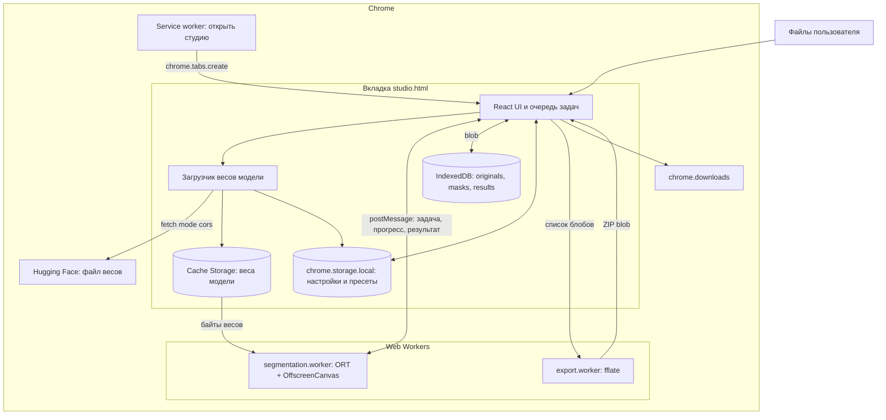
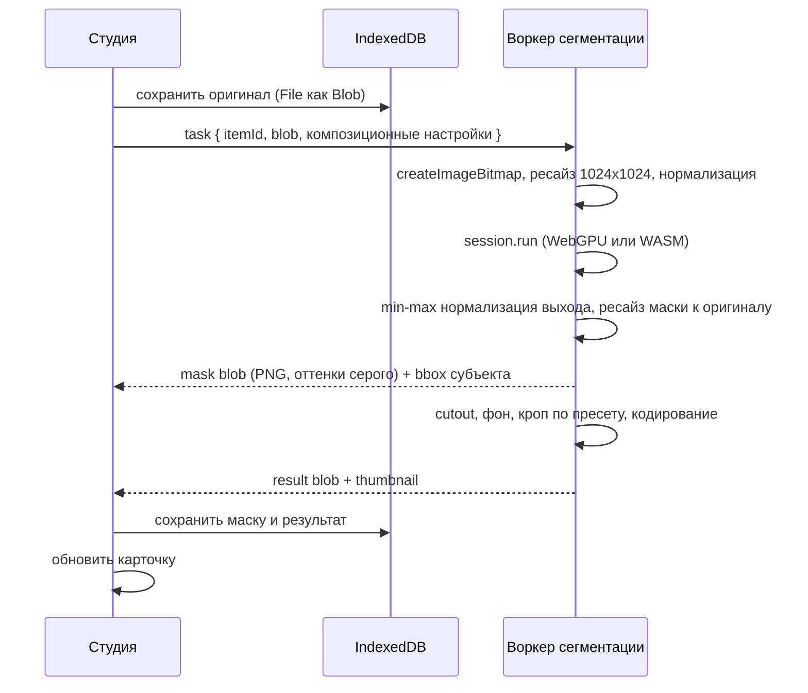

# 02. Архитектура

## Контексты исполнения

Расширение состоит из четырёх контекстов. Тяжёлая работа вынесена с UI-потока.

- Service worker (`background`). Единственная задача: по клику на иконку открыть или
  сфокусировать вкладку студии. Никакой обработки изображений: SW в MV3 засыпает, и WebGPU
  в нём недоступен.
- Страница студии (`studio.html`, обычная вкладка расширения). React-приложение: состояние
  сессии, интерфейс, оркестрация очереди, доступ к IndexedDB и `chrome.downloads`.
- Воркер сегментации (`segmentation.worker.ts`, module worker). Держит `InferenceSession`
  ORT, декодирует изображение, гоняет модель, возвращает маску. Один экземпляр, очередь
  строго последовательная.
- Воркер экспорта (`export.worker.ts`). Сборка ZIP, чтобы не морозить UI на больших пачках.

Композиция (наложение маски, фон, кроп, кодирование в PNG/JPEG/WebP) делается через
`OffscreenCanvas`; в v1 живёт в воркере сегментации, чтобы не гонять большие блобы между
контекстами лишний раз. Если профилирование покажет проблему, выносится в отдельный
воркер композиции — интерфейс модуля это допускает.

## Диаграмма контекстов



## Поток данных для одного изображения



## Разделение «сегментация» и «композиция»

Это главное архитектурное решение. Прогон модели дорогой (сотни миллисекунд на GPU,
секунды на CPU), а композиция дешёвая (десятки миллисекунд). Поэтому маска сохраняется
в IndexedDB как самостоятельный артефакт, и любое изменение настроек фона, края, пресета,
слепка на картинке или формата вывода запускает только пересчёт композиции из пары
«оригинал + маска».

Следствие для кода: `segment(image) -> Mask` и `compose(image, mask, settings) -> Blob` —
два независимых модуля без общего состояния.

## Манифест

```json
{
  "manifest_version": 3,
  "name": "rmbg",
  "version": "0.1.0",
  "minimum_chrome_version": "121",
  "action": { "default_title": "Открыть студию удаления фона" },
  "background": { "service_worker": "service-worker.js", "type": "module" },
  "permissions": ["storage", "downloads"],
  "content_security_policy": {
    "extension_pages": "script-src 'self' 'wasm-unsafe-eval'; object-src 'self'; connect-src 'self' https://huggingface.co https://*.hf.co https://*.aws.cdn.hf.co"
  },
  "cross_origin_embedder_policy": { "value": "require-corp" },
  "cross_origin_opener_policy": { "value": "same-origin" }
}
```

Пояснения к каждому нетривиальному ключу:

- `'wasm-unsafe-eval'` в CSP обязателен: без него WebAssembly в страницах расширения не
  компилируется. Это максимум, что MV3 разрешает добавить в `script-src`; `'unsafe-eval'`
  Chrome отвергает на этапе установки.
- `connect-src` сужен до `'self'`, Hugging Face (`huggingface.co`, `*.hf.co`) и CDN
  (`*.aws.cdn.hf.co` — туда уходит 302 с resolve). Это единственные разрешённые внешние
  хосты; служит аргументом при ревью Chrome Web Store: исполняемый код из сети не
  подтянуть. Важно: в CSP `*` матчит ровно одну метку хоста, поэтому `*.hf.co` не
  покрывает `us.aws.cdn.hf.co` — нужен отдельный `*.aws.cdn.hf.co`.
- `cross_origin_embedder_policy` + `cross_origin_opener_policy` включают cross-origin
  isolation для origin расширения. Это даёт `SharedArrayBuffer`, а значит многопоточный
  WASM-бэкенд ORT вместо однопоточного. Важно: `COEP: require-corp` не блокирует
  запросы в режиме `cors` — им достаточно `Access-Control-Allow-Origin` на ответе; CORP
  нужен только для `no-cors`. Поэтому `fetch` весов обязан идти с `mode: 'cors'`. Если
  написать `no-cors`, получим пустую ошибку без понятной причины.
- `web_accessible_resources` не нужен: веса и wasm грузит сама страница расширения, то есть
  same-origin для локальных ресурсов. Ключ появится, только если когда-нибудь понадобится
  content script.
- `minimum_chrome_version` держим на уровне, где WebGPU стабилен; точное значение сверяем
  при первой сборке.
- Прав минимум: `storage` для настроек, `downloads` для сохранения архива. Ни `tabs`
  (создание вкладки доступно без него для собственных страниц), ни host permissions —
  при условии, что CORS Hugging Face через редирект на CDN работает (см. ниже).

## Сеть: единственный запрос

В рантайме расширение делает ровно один класс сетевых запросов: разовая загрузка файла
весов модели с зафиксированного адреса на Hugging Face (пин на коммит). После успешной
загрузки и проверки SHA-256 работа полностью офлайн. ORT, `.wasm`-файлы и все скрипты
загружаются по `chrome.runtime.getURL(...)`, то есть из пакета.

Пользовательские изображения никуда не отправляются никогда.

Запасная ветка по CORS: спайк (июль 2026) показал, что цепочка
`huggingface.co/…/resolve/<commit>/…` → `us.aws.cdn.hf.co` отдаёт
`Access-Control-Allow-Origin` и на resolve (отражение Origin, включая
`chrome-extension://…`), и на CDN (`*`). Для `mode: 'cors'` этого достаточно, CORP не
нужен. `host_permissions` пока не требуются. Если Hugging Face сменит схему CDN или
уберут ACAO — запасная ветка: `host_permissions` на `https://huggingface.co/*` и
`https://*.aws.cdn.hf.co/*` ценой запроса прав при установке. Подробности загрузчика —
в [03-inference.md](03-inference.md).

## Обработка ошибок и деградация

- WebGPU недоступен или адаптер не выдан — сразу WASM-путь, в шапке студии бейдж режима.
- Сессия WebGPU не создалась или упала на первом прогоне — одноразовое пересоздание сессии
  на WASM, все последующие задачи идут туда, пользователю показывается уведомление с
  причиной.
- Ошибка на конкретном изображении (не декодировалось, нехватка памяти) — карточка в статусе
  `failed` с человекочитаемой причиной и кнопкой «повторить»; очередь продолжает работу.
- Нехватка места в IndexedDB (`QuotaExceededError`) — останавливаем очередь и предлагаем
  скачать уже готовое и очистить сессию.

## Открытые вопросы

- Проверить на распакованной сборке, что дочерние воркеры страницы наследуют cross-origin
  isolation и `crossOriginIsolated === true` внутри воркера (Diagnostics); если нет —
  включать однопоточный WASM.
- Замерить, выгоднее ли композицию делать в отдельном воркере при пачке 50+ кадров.
- ~~Спайк CORS Hugging Face~~ — закрыт и перепроверен (2026-08-03): при
  `Origin: chrome-extension://…` resolve отражает Origin в ACAO, CDN
  (`us.aws.cdn.hf.co`) отдаёт `Access-Control-Allow-Origin: *`; `host_permissions` не
  нужны. `connect-src` включает `*.aws.cdn.hf.co`. Окончательный smoke-тест fetch под
  реальным `COEP: require-corp` из загруженного `dist` — перед первой подачей в CWS
  (см. [cws/submission.md](cws/submission.md)).
