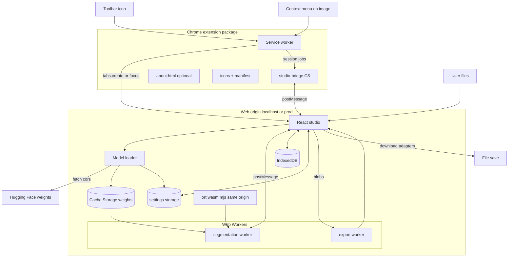
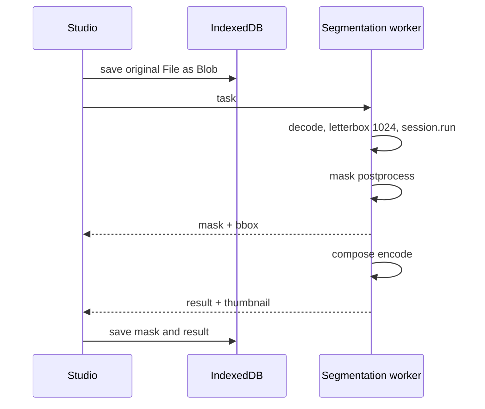

# 02. Архитектура

## Два артефакта, один репозиторий

| Артефакт | Сборка | Содержимое |
| --- | --- | --- |
| **Web-студия** | `vite.config.web.ts` → `dist-web/` | React UI, workers, ORT wasm/mjs, about |
| **Расширение** | `vite.config.ts` → `dist/` | service worker, studio-bridge CS, about, icons, manifest |

Студия **не** открывается как `chrome-extension://…/studio.html`. Service worker
открывает (или фокусирует) URL web-студии — сейчас `http://localhost:5173/`
(`STUDIO_WEB_URL` в `src/platform/studio-url.ts`). Позже — прод-домен без смены
архитектуры.

Shared-код (`src/core`, `src/studio`, `src/workers`, `src/platform`) общий; границы npm-пакетов
и monorepo пока не вводим.

## Контексты исполнения

- **Service worker** (`background`). Иконка → `tabs` для URL студии. Контекстное меню
  на `image`: fetch `srcUrl`, job в `chrome.storage.session`, фокус студии.
  Обработки изображений (ONNX) нет.
- **Content script** (`studio-bridge.js`) — **только** на origin студии: мост
  `chrome.runtime` ↔ `window.postMessage` (jobs + синк имён экспортов для меню).
- **Страница студии** (origin web-приложения). React: сессия, UI, очередь, IndexedDB,
  platform-адаптеры storage/download/assets, fetch весов, приём jobs из bridge.
- **Воркер сегментации** (`segmentation.worker.ts`). `InferenceSession`, decode, model run, mask / compose.
- **Воркер экспорта** (`export.worker.ts`). ZIP через fflate.
- **About** — `about.html`: в web-сборке на том же origin; в extension-сборке остаётся
  страницей расширения (офлайн-политиками), ссылка «назад» ведёт на URL студии.

Композиция в v1 живёт в воркере сегментации (`OffscreenCanvas`).

## Слой платформы (`src/platform/`)

Chrome-специфика не размазана по UI/core. Флаг сборки `import.meta.env.VITE_APP_TARGET`
(`web` | `extension`):

| API | extension | web |
| --- | --- | --- |
| настройки | `chrome.storage.local` | `localStorage` (префикс `rmbg:`) |
| скачивание файлов | `chrome.downloads` | File System Access / `<a download>` |
| URL статики | `chrome.runtime.getURL` | `new URL(..., origin)` (абсолютный; нужен ORT) |
| URL студии | константа `STUDIO_WEB_URL` | — |

## Диаграмма контекстов



## Поток данных для одного изображения



## Разделение «сегментация» и «композиция»

Дорогая сегментация один раз; маска в IndexedDB; смена export / edge / override — только
`compose`. Модули: `segment(image) -> Mask`, `compose(image, mask, settings) -> Blob`.

## Манифест расширения (этап localhost)

```json
{
  "manifest_version": 3,
  "name": "PNG Maker",
  "version": "0.1.0",
  "minimum_chrome_version": "121",
  "action": { "default_title": "Open PNG Maker" },
  "background": { "service_worker": "service-worker.js", "type": "module" },
  "permissions": ["storage", "downloads", "contextMenus", "activeTab", "scripting"],
  "host_permissions": ["http://localhost:5173/*"],
  "optional_host_permissions": ["http://*/*", "https://*/*"],
  "content_scripts": [
    {
      "matches": ["http://localhost:5173/*"],
      "js": ["studio-bridge.js"],
      "run_at": "document_end"
    }
  ]
}
```

- `host_permissions` на localhost — чтобы `tabs.query({ url })` видел URL студии.
  На проде — origin студии вместо localhost; matches content script — тот же origin.
- Картинка с ПКМ: `activeTab` + `scripting` на вкладке клика; при CDN на другом origin —
  optional permission только на этот origin (не install-time доступ ко всем сайтам).
- Content script **только** на origin студии (мост jobs / меню экспортов).
- CSP / COEP / COOP в манифесте относятся к **extension pages** (about), не к web-студии.
  `connect-src` для SW узкий (HF); байты картинки SW сам не качает.
- Web-студия задаёт COOP/COEP через заголовки Vite `server` / `preview` (и позже — CDN
  / reverse-proxy на проде): нужны `SharedArrayBuffer` / `crossOriginIsolated` для ORT.
- Настройки студии на web — `localStorage`; в `chrome.storage.local` расширение держит
  только список `{id,name}` экспортов для submenu.

## Сеть

Студия: разовая загрузка `.onnx` с HF (CORS, `mode: 'cors'`), SHA-256, Cache Storage.
ORT `.wasm`/`.mjs` — same-origin (`/ort/` или absolute `origin/ort/`).

Запасная ветка CORS HF — как раньше: `host_permissions` на HF/CDN, если ACAO пропадёт.

Расширение: разовый `fetch(srcUrl)` выбранной картинки в SW при клике меню.

## WASM threads (web vs extension)

При `crossOriginIsolated` ORT может поднимать pthread-воркеры. На **web** (Vite dev и
в целом web-target) `numThreads = 1`: вложенные dynamic import `.mjs` воркеров в dev
зависают на инициализации. В **extension** target при isolation — до 4 потоков.

## Обработка ошибок

Без изменений: фолбэк WebGPU→WASM, failed-карточки, quota, evicted cache, cancel download.
Ошибка fetch картинки из меню — toast в студии (`error` job).

## Открытые вопросы

- Прод-домен, деплой `dist-web`, замена `STUDIO_WEB_URL` + matches CS.
- Вернуть ли ORT threads на web production после проверки preview/CDN.
- Материалы CWS vs thin package + hosted studio.
