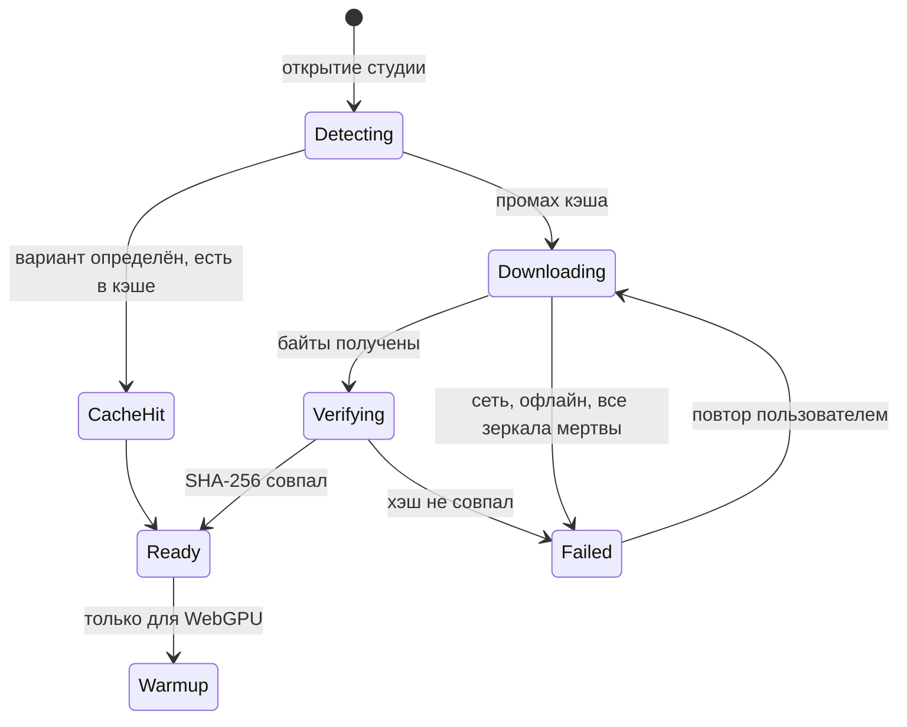
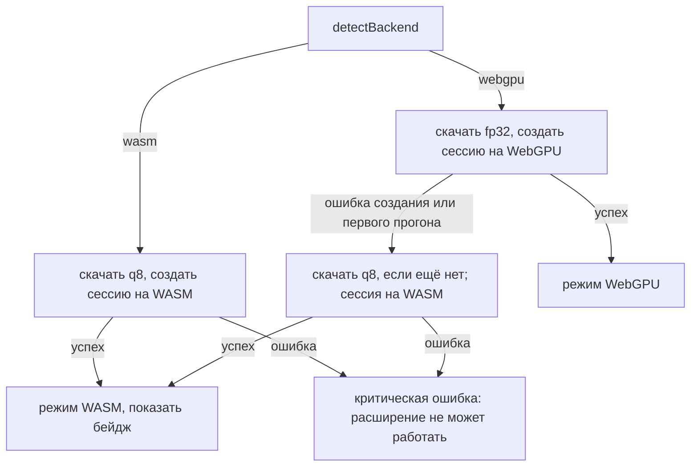
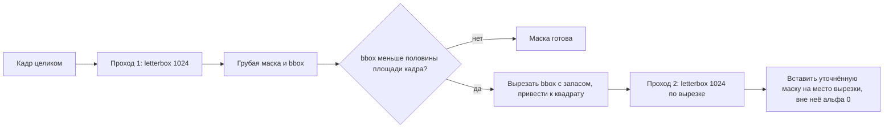

# 03. Инференс: модель и рантайм

## Модель

Используем IS-Net в варианте `isnet-general-use`. Веса опубликованы под Apache-2.0, коммерческое использование разрешено.

Форма входа и выхода:

- вход: `float32[1, 3, 1024, 1024]`, NCHW, RGB;
- выход: карта значимости `float32[1, 1, 1024, 1024]` (первый выход сессии, в оригинале `d1`).

Имена входа и выхода не хардкодим: берём `session.inputNames[0]` и `session.outputNames[0]`,
это защищает от расхождений между экспортами.

## Два файла весов

Качаем ровно один нужный вариант — какой, решает детект бэкенда при открытии студии:

- `isnet-general-use.onnx`, около 176 МБ — для WebGPU. Полная точность.
- `isnet-general-use-q8.onnx`, около 44 МБ — для WASM. Динамическая uint8-квантизация,
  примерно вчетверо меньше и заметно быстрее на CPU, качество маски практически то же.

Почему не один файл на оба пути: WebGPU-бэкенд ORT не имеет шейдерных реализаций для
операторов динамической квантизации (`DynamicQuantizeLinear`, `ConvInteger` и родственных),
поэтому на квантованной модели значительная часть графа упадёт обратно на CPU и выигрыш от
GPU потеряется. Обратно, fp32 на WASM работает, но в разы медленнее q8.

Веса не входят в пакет **расширения** и не лежат в git: скачиваются в рантайме
**web-студии** с Hugging Face и кэшируются в Cache Storage origin студии —
см. раздел «Загрузка весов» ниже и Р-16 / Р-27 в [08-decisions.md](08-decisions.md).
ORT (`.wasm` / `.mjs`) отдаётся с origin студии (`dist-web/ort/`), не с HF.

## Выбор execution provider

```ts
import * as ort from 'onnxruntime-web/webgpu';
import { isWeb } from '../../platform/env';

export type Backend = 'webgpu' | 'wasm';

async function detectBackend(): Promise<Backend> {
  if (!('gpu' in navigator)) return 'wasm';
  try {
    const adapter = await navigator.gpu.requestAdapter();
    return adapter ? 'webgpu' : 'wasm';
  } catch {
    return 'wasm';
  }
}

export async function createSession(
  backend: Backend,
  modelBytes: Uint8Array,
  ortWasmDir: string,
) {
  ort.env.wasm.wasmPaths = ortWasmDir;
  // web-target: always 1 thread (Vite nested pthread workers hang);
  // extension + crossOriginIsolated: up to 4
  ort.env.wasm.numThreads =
    isWeb || !self.crossOriginIsolated
      ? 1
      : Math.min(4, navigator.hardwareConcurrency || 1);

  return ort.InferenceSession.create(modelBytes, {
    executionProviders: [backend],
    graphOptimizationLevel: 'all',
  });
}
```

Важные детали:

- Импорт именно из `onnxruntime-web/webgpu`, иначе EP `'webgpu'` не зарегистрирован.
- Сессия создаётся из буфера весов (`Uint8Array`), а не из URL пакета: байты приходят из
  Cache Storage после загрузки и проверки хэша.
- `wasmPaths` указывает на каталог с `.wasm`/`.mjs` внутри пакета; путь приходит в воркер
  из страницы как результат `chrome.runtime.getURL('ort/')`. Воркер не полагается на наличие
  `chrome.*` у себя — это делает его тестируемым и снимает вопросы о доступности API.
- В `executionProviders` передаём ровно один провайдер, а не список `['webgpu', 'wasm']`.
  Список даёт неявный фолбэк на уровне ORT, но с ним мы не узнаем, что упали на CPU, и
  вдобавок останемся на неподходящем файле весов. Фолбэк делаем сами, явно.

## Загрузка весов

Порядок при открытии студии: сначала `detectBackend()` (с учётом `backendOverride` из
настроек), потом проверка кэша, потом при промахе — скачивание. Без детекта непонятно,
качать fp32 (176 МБ) или q8 (44 МБ).



Источник: Hugging Face, пин на конкретный коммит. Основное зеркало —
`SacredNoir/isnet-general-use-onnx` (оба файла, Apache-2.0), запасное для fp32 —
`x-Liola-x/isnet-general-use-onnx`. URL вида:

```
https://huggingface.co/SacredNoir/isnet-general-use-onnx/resolve/<commit>/isnet-general-use.onnx
https://huggingface.co/SacredNoir/isnet-general-use-onnx/resolve/<commit>/isnet-general-use-q8.onnx
```

Коммит и эталонные хэши фиксируются в коде загрузчика (не в git LFS):

| Вариант | Размер (байт) | SHA-256 |
| --- | --- | --- |
| fp32 | 176 213 804 | `4c56bbc21588459dda11efba5a4a8ee163969da109ae170fb1988c1c2ea4a90a` |
| q8 | 44 436 071 | `feed6f32a5e707ca7e939576b2d891b23fb9eb4114749657a5efc64e8651e43a` |

Алгоритм загрузчика:

1. Запросить `navigator.storage.persist()` до скачивания.
2. Открыть `caches.open('rmbg-models')`. Ключ кэша — канонический URL варианта (пин на
   коммит). При попадании — отдать байты без сети.
3. При промахе: перебрать список зеркал по порядку. Каждый `fetch(url, { mode: 'cors' })` —
   обязательно `cors`, иначе под `COEP: require-corp` запрос упадёт. Читать тело потоком
   (`response.body.getReader()`), считать прогресс по `Content-Length`, собирать в
   `Uint8Array`.
4. Проверить `crypto.subtle.digest('SHA-256', bytes)` против эталона. Потокового API нет —
   буфер держим целиком. При несовпадении — следующее зеркало; при исчерпании списка —
   состояние `Failed`.
5. Записать в Cache Storage (`cache.put(url, new Response(bytes))`) и метаданные
   ассета в настройки через platform storage (см. [05-data-model.md](05-data-model.md)).
6. Отдать байты в `createSession`.

Отмена: `AbortController` на текущий `fetch`; кнопка в UI. Повтор при обрыве или офлайне —
из состояния `Failed` пользователь жмёт «Повторить».

## Фолбэк



Фолбэк одноразовый и односторонний: если ушли на WASM, обратно в рамках сессии страницы
не возвращаемся. Если при фолбэке с WebGPU q8 ещё не в кэше — качаем его отдельно
(ещё один сетевой запрос, редкий путь).

## Прогрев

Прогрев — один прогон на нулевом тензоре 1024x1024. Он стартует только после состояния
`Ready` (веса скачаны, хэш совпал, сессия создана). Политика разная по бэкендам, потому
что цена у него разная.

На WebGPU первый прогон компилирует WGSL-программы под каждую пару «оператор + форма».
При фиксированном входе это сотни пайплайнов, и первый прогон в разы дольше последующих.
Компиляция всё равно произойдёт — либо на прогреве, либо на первой пользовательской
картинке, — так что чистая доплата за прогрев составляет один форвард-пасс с уже
прогретым кэшем шейдеров. Взамен получаем раннюю проверку совместимости операторов и
базовый замер времени для оценки остатка в UI. Греем всегда.

На WASM компилировать нечего: prepacking весов и аллокация арены выполняются при создании
сессии. Прогревочный прогон здесь — полноценный инференс на CPU, то есть секунды, отобранные
у отзывчивости вкладки, ради раскрутки пула потоков. Не греем; первое изображение пачки
играет роль прогрева, и его время не учитывается в оценке оставшегося.

Прогрев не блокирует интерфейс: скачивание и прогрев идут фоном, пока пользователь
перетаскивает файлы и настраивает пресет. К моменту нажатия «Обработать» ассет обычно уже
готов; если нет — очередь ждёт состояния `Ready` (и завершения прогрева на WebGPU),
кнопка показывает «модель загружается» или «модель готовится».

Отдельно стоит помнить, что на фоне скачивания и инициализации сессии прогрев невелик:
чтение 176 МБ, разбор графа и загрузка весов в видеопамять — это единицы секунд поверх
самого скачивания, и они неизбежны при любой политике прогрева.

## Препроцессинг: letterbox с сохранением пропорций

Вход модели квадратный, 1024x1024, а фотографии — нет. Растяжение в квадрат (так делают
референсные реализации DIS и `rembg`) искажает геометрию объекта и портит тонкие детали,
поэтому мы его не используем. Обрезка кадра до квадрата тоже исключена: до сегментации
неизвестно, где объект, и у вертикального кадра 3:4 мы срежем часть товара.

Используем letterbox: вписываем кадр целиком, недостающее до квадрата дополняем полями.

1. `createImageBitmap(blob, { colorSpaceConversion: 'none' })` — декодирование вне
   UI-потока. Отключение конвертации профиля обязательно: у фотографий со встроенным ICC
   браузер иначе перегонит цвета, и результат уедет относительно оригинала, с которого
   мы потом делаем cutout.
2. Расчёт геометрии:
   `scale = min(1024 / w, 1024 / h)`, `sw = round(w * scale)`, `sh = round(h * scale)`,
   `dx = floor((1024 - sw) / 2)`, `dy = floor((1024 - sh) / 2)`.
   Поля появляются только по одной оси (по обеим — лишь у точного квадрата, где их нет вовсе).
3. Отрисовка кадра в `OffscreenCanvas(1024, 1024)` в прямоугольник `(dx, dy, sw, sh)` при
   `imageSmoothingEnabled = true` и `imageSmoothingQuality = 'high'`. Уменьшение в четыре
   раза и более с настройками по умолчанию даёт алиасинг на тонких деталях, а именно они
   и определяют качество кромки.
4. Заполнение полей продолжением крайних пикселей (edge-replicate). Нейтральная заливка
   создала бы на границе кадра искусственный контраст, который модель приняла бы за край
   объекта; продолжение края такой ложной границы не даёт. Реализация — два самокопирования
   канвы: строку `y = dy` растянуть вверх на всю ширину, строку `y = dy + sh - 1` — вниз
   (для вертикальных полей симметрично по столбцам). Углы закрываются автоматически.
5. `getImageData` → `Float32Array[1*3*1024*1024]`, раскладка по каналам (NCHW).
6. Нормализация: `v = pixel / 255`, затем `(v - 0.5) / 1.0`, то есть mean 0.5 и std 1.0 на
   все три канала.

Геометрия letterbox (`dx`, `dy`, `sw`, `sh`) передаётся в постпроцессинг: без неё маску не
вернуть к исходному кадру.

## Постпроцессинг

1. Взять выход, найти минимум и максимум, привести к диапазону 0..1:
   `m = (v - min) / (max - min)`. Без этого маска получается блёклой.
2. Записать в `ImageData` 1024x1024 как оттенки серого, получить `ImageBitmap`.
3. Вырезать полезную область `(dx, dy, sw, sh)` — то, что попало на поля letterbox’а,
   отбрасывается вместе с ними.
4. Сохранить как есть, в родном разрешении прохода. К размеру оригинала маска не
   поднимается: апскейл и настройки края применяются на стадии композиции, см.
   [04-pipeline.md](04-pipeline.md).

Вместе с маской сохраняется область оригинала, которую она покрывает (`coverage`): для
одного прохода это весь кадр, для второго — вырезка вокруг объекта. Без неё маску не
наложить обратно.

## Второй проход по объекту

Когда товар занимает малую часть кадра, после letterbox’а на него приходится небольшая доля
из 1024x1024, и маска получается грубой на тонких деталях. Лечится вторым проходом по
вырезанному объекту.



Правила:

- Условие запуска: площадь bbox меньше 50% площади кадра и второй проход даёт реальный
  прирост разрешения (масштаб вырезки минимум в 1.3 раза крупнее, иначе смысла нет).
- Запас вокруг bbox — 12% от его длинной стороны с каждой стороны, с обрезкой по границам
  кадра. Запас нужен, чтобы объект не касался края входа: на самой границе модель
  систематически ошибается.
- Вырезка расширяется до квадрата, насколько позволяют границы кадра; остаток добирается
  тем же letterbox’ем. Так объект попадает в модель без искажения пропорций.
- Вне вырезки альфа равна нулю. Это корректно по построению: bbox по определению содержит
  все пиксели маски выше порога, а запас его только расширяет.
- Если второй проход вернул пустую маску, оставляем результат первого и помечаем это в
  диагностике. Молча отдать пустой результат хуже, чем грубую маску.
- Цена — удвоение времени инференса на таких кадрах. В оценке оставшегося времени в UI это
  учитывается: решение о втором проходе известно до его запуска.

## Потолок качества

Разрешение меняется только у копии, уходящей в модель. Оригинал не модифицируется: cutout
делается по полному разрешению, из маски берётся исключительно альфа-канал. Цвет и
детализация самого товара не теряются вообще — ограничена только точность кромки.

Кадр 3000x4000 ужимается в 1024 по длинной стороне, то есть примерно вчетверо, и
переходная зона маски в пересчёте на исходные пиксели получается шириной около 4-8 px.
Важно при этом соотношение не с оригиналом, а с размером вывода: холст пресета обычно
900x1200 или 1200x1600, и при схлопывании 4000 px в 1200 погрешность в четыре исходных
пикселя превращается примерно в один пиксель результата, то есть тонет в сглаживании.
Ограничение становится заметным, только когда результат отдаётся в исходном разрешении и
рассматривается при 100%.

Независимо от разрешения плохо даются волосы, мех, кружево, тонкие провода и
полупрозрачные материалы. Это ограничение не масштаба, а самой задачи: модель сегментации
даёт по сути бинарную границу и не умеет передавать частичную прозрачность. Настоящая
альфа требует матирования, а не сегментации.

Что уже работает против этого потолка: letterbox вместо растяжения, второй проход по
объекту, ползунки края. Что отложено в v1.1 — направляемая фильтрация края
(см. Р-15 в [08-decisions.md](08-decisions.md)).

## Производительность и память

- Очередь сегментации строго последовательная (concurrency 1). Параллельные прогоны на
  одной GPU-сессии не ускоряют, но надёжно приводят к нехватке видеопамяти.
- Сессия создаётся один раз и живёт до закрытия вкладки. Повторное создание на каждое
  изображение стоит секунды.
- После каждой задачи закрываем `ImageBitmap` (`.close()`) и не держим ссылок на большие
  канвы: пиковая память должна зависеть от размера одного изображения, а не от размера пачки.
- Промежуточные артефакты уезжают в IndexedDB, в памяти держим только миниатюры для грида.
- `graphCapture` для WebGPU (фиксированная форма входа это позволяет) рассматриваем как
  оптимизацию второй итерации, не в первой реализации.

## Диагностика

В студии есть скрытый за кнопкой экран диагностики: выбранный бэкенд, причина фолбэка,
имя GPU-адаптера, `crossOriginIsolated`, число потоков WASM, состояние ассета модели
(в кэше / качается / готов / ошибка), URL зеркала, время загрузки модели, время
последнего прогона. Это первое, что спросим у пользователя при жалобе на скорость.

## Открытые вопросы

- Проверить фактическое число выходов у выбранного экспорта: некоторые сборки IS-Net
  отдают все шесть side-outputs, тогда берём первый и игнорируем остальные.
- Подобрать порог включения второго прохода на реальных кадрах: 50% площади и прирост
  масштаба 1.3 — стартовые значения, а не измеренные.
- Спайк памяти: пик при `InferenceSession.create` из буфера 176 МБ (буфер в JS-куче плюс
  копия в куче wasm). Делается при первой сборке с реальным ORT; если упирается — искать
  способ отдать ORT поток вместо массива. CORS-часть спайка закрыта (см.
  [02-architecture.md](02-architecture.md)).
- Зафиксировать точный SHA коммита `SacredNoir/isnet-general-use-onnx` в коде загрузчика
  при первой сборке (сейчас ориентир: `ff56cb825ee2637d4726f8a739fb7bf1bf4bea04`).
