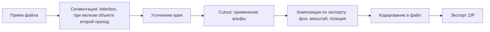

# 04. Конвейер обработки, композиция и экспорт

## Стадии



Стадии A и B выполняются один раз на изображение. Стадии C-F пересчитываются при любом
изменении настроек и не требуют модели.

## Приём файлов

Три пути: drag & drop на всю область студии, диалог выбора файлов, вставка из буфера
(`paste` с `DataTransfer`). Принимаем `image/png`, `image/jpeg`, `image/webp`; всё остальное
отклоняем с понятным сообщением.

Каждый принятый файл сразу пишется в IndexedDB как Blob, в памяти остаётся только миниатюра
(длинная сторона 256 px) для грида. Дубликаты по имени допускаются, разводятся при экспорте.

## Восстановление маски в полное разрешение

Маска хранится в родном разрешении прохода (см. [05-data-model.md](05-data-model.md)),
поэтому композиция начинается с её разворачивания:

1. Создать канву размера оригинала, залить нулевой альфой.
2. Нарисовать маску в прямоугольник `coverage`, приведённый к пикселям оригинала, при
   `imageSmoothingQuality = 'high'`. Вне `coverage` остаётся ноль — фон.

Это стоит единицы миллисекунд и выполняется при каждой перекомпозиции. Взамен маска
занимает в IndexedDB в разы меньше места, а настройки края применяются к полноразмерной
маске, то есть остаются полностью обратимыми: ползунок можно двигать в любую сторону,
не теряя данных.

## Уточнение края маски

Три настройки, применяются к развёрнутой маске перед cutout, в этом порядке:

- `threshold` (0..1, по умолчанию 0): значения ниже порога обнуляются, выше — остаются как
  есть. Ноль означает мягкую полупрозрачную кромку, повышение делает край жёстче.
- `erode` (пиксели, по умолчанию 0..1): поджатие маски внутрь. Убирает светлый ореол от
  старого фона по контуру — типичная проблема на белом фоне.
- `feather` (пиксели, по умолчанию 0): размытие кромки для мягкого перехода.

Реализация: свёртки по альфа-каналу на `OffscreenCanvas`. Feather — через `ctx.filter =
'blur(Npx)'` при перерисовке маски (аппаратно, дёшево). Erode — минимум по окну, считаем
руками по `ImageData`, окно 3x3 применяем N раз; при N до 3 стоимость незаметна.

## Cutout

```ts
const canvas = new OffscreenCanvas(width, height);
const ctx = canvas.getContext('2d');
ctx.drawImage(source, 0, 0);
ctx.globalCompositeOperation = 'destination-in';
ctx.drawImage(maskBitmap, 0, 0, width, height);
```

Результат — RGBA с прозрачным фоном в исходном разрешении. Это промежуточный артефакт,
на диск не сохраняется.

## Bounding box субъекта

Считается один раз на стадии сегментации и хранится вместе с маской: минимальный
прямоугольник, охватывающий пиксели с альфой выше порога значимости (берём фиксированный
0.5 независимо от пользовательского `threshold`, чтобы геометрия не прыгала при подкрутке
края). Хранится в нормализованных координатах 0..1, чтобы не зависеть от разрешения.

Тот же bbox используется двояко: как условие и область второго прохода модели
(см. [03-inference.md](03-inference.md)) и как геометрия размещения на холсте пресета.
Сохраняется финальный bbox — пересчитанный по уточнённой маске, если второй проход был.

Вырожденный случай (маска пустая — модель ничего не нашла): bbox равен всему кадру,
карточка помечается предупреждением «No subject detected» / «Объект не найден».

## Экспорт (Preset в коде)

В интерфейсе — **export** / «экспорт»; тип в коде остаётся `Preset`
(см. [09-glossary.md](09-glossary.md)).

```ts
type Preset = {
  id: string;
  name: string;
  // original — полный кадр исходника; fixed — холст, отступы (UI: padding) и выравнивание
  sizeMode: 'original' | 'fixed';
  canvas: { width: number; height: number };
  fit: {
    // доля холста, оставляемая пустой по каждой стороне (UI: Padding)
    margin: { top: number; right: number; bottom: number; left: number };
    // как вписывать: целиком по обеим осям или по ширине с возможным обрезом
    mode: 'contain' | 'cover-width';
    // разрешение увеличивать субъект выше 100% исходного масштаба
    allowZoom: boolean;
  };
  anchor: 'center' | 'top' | 'bottom';
  background: { kind: 'transparent' } | { kind: 'solid'; color: string };
  output: { format: 'png' | 'jpeg' | 'webp'; quality: number };
};
```

При `sizeMode === 'original'` cutout кладётся на холст исходного размера (только фон и
формат), без масштаба и полей.

При `sizeMode === 'fixed'` алгоритм размещения:

1. Взять bbox субъекта в пикселях исходника.
2. Вычислить доступную область холста: `width - (marginLeft + marginRight) * width`,
   аналогично по высоте.
3. Масштаб: `min(availW / bboxW, availH / bboxH)` для `contain`, либо `availW / bboxW`
   для `cover-width`. При `allowZoom === false` масштаб ограничен единицей.
4. Позиция по горизонтали — всегда по центру доступной области. По вертикали — согласно
   `anchor`: центр, верхняя граница области или нижняя (важно для товаров, «стоящих» на полу).
5. Залить фон (для `transparent` не заливать ничего), нарисовать bbox cutout в `dest`.

Ограничение форматов: `transparent` совместим только с `png` и `webp`. При выборе `jpeg`
фон принудительно становится однотонным, интерфейс это показывает, а не тихо подставляет
чёрный.

Пользователь держит список экспортов: один активный управляет превью студии и
перекомпозицией, отмеченные галочками попадают в ZIP — каждый в своей папке по имени
экспорта. Сегментация выполняется один раз; для активного экспорта результат кэшируется,
остальные композятся при сборке архива из маски.

Перед композицией и экспортом настройки проходят через `resolveComposition`: если у
изображения есть слепок (`ItemOverride`) для данного `presetId`, layout/background/edge
берутся из него (см. [05-data-model.md](05-data-model.md)).

## Кодирование

`canvas.convertToBlob({ type, quality })` в воркере. Для `png` параметр `quality`
игнорируется. Для `jpeg`/`webp` по умолчанию 0.92.

## Пересчёт при смене настроек

Изменение фона, края или экспорта помечает элементы как `stale` **поэлементно**
(по хэшу эффективной пары) и запускает перекомпозицию: читаем из IndexedDB оригинал и
маску, проходим стадии C-F, перезаписываем результат. Дебаунс 200 мс на изменения
ползунков, иначе перетаскивание слайдера запускает десятки пересчётов. Изображения со
слепком не становятся stale при правке глобального экспорта/края.

Приоритет очереди перекомпозиции: открытое в просмотре изображение, затем видимые в
гриде, затем остальные.

## Экспорт ZIP

- Библиотека `fflate`, потоковый режим (`Zip` + `AsyncZipDeflate`).
- Уровень сжатия 0 (store): PNG, JPEG и WebP уже сжаты, дефлейт даст доли процента при
  заметных затратах времени.
- Файлы читаются из IndexedDB по одному, а не собираются в память целиком.
- Структура архива: папка на каждый отмеченный экспорт (`<имя экспорта>/<файл>`). Имя
  папки санитизируется; при коллизии — суффикс `-2`, `-3`.
- Имя файла: `<ItemRecord.name без расширения>.<новое расширение>` (после
  переименования в карточке — уже новое имя). При коллизии внутри папки —
  суффикс `-2`, `-3`.
- Для каждого элемента считается эффективная пара через `resolveComposition`; для
  активного экспорта со свежим `result` (хэш совпал) берётся кэш, иначе — compose из маски.
- Имя архива: `rmbg-YYYYMMDD-HHmm.zip`.
- Скачивание: `URL.createObjectURL(zipBlob)` → `chrome.downloads.download({ url, filename,
  saveAs: true })`, затем `URL.revokeObjectURL` после события завершения загрузки.
  Ранний revoke ломает скачивание больших архивов.
- В архив попадают только выбранные карточки со статусом `done`.

## Открытые вопросы

- Нужен ли режим «сохранить в папку» через File System Access API вместо ZIP — удобнее,
  но добавляет отдельный путь сохранения; кандидат в v1.1.
- Стоит ли класть в архив исходники и маски отдельными подпапками (полезно для доработки
  в редакторе) — как опция экспорта.
